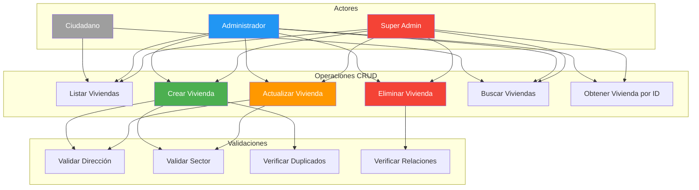
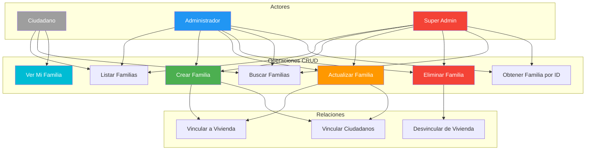
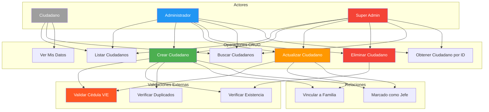
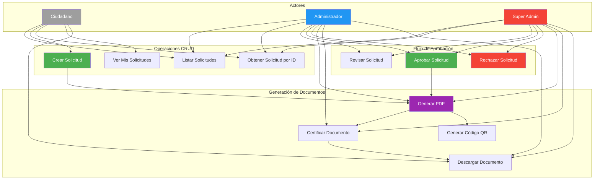
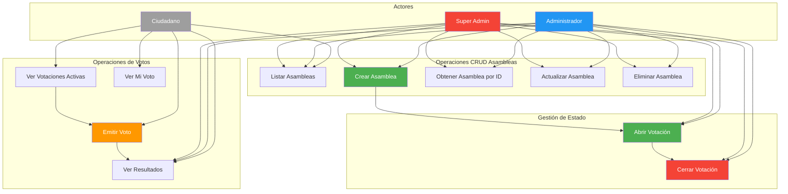
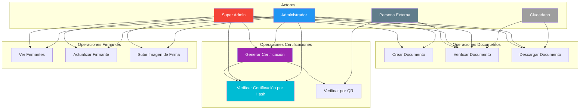
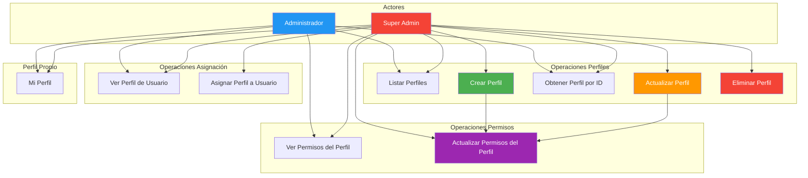
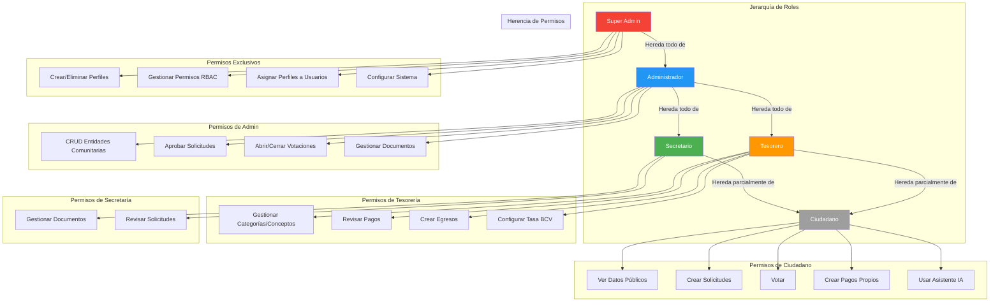

# Diagramas CRUD y Permisología - Manoa Core

## Visión General

Este documento detalla **cada operación CRUD** por separado y el **sistema de permisos completo** del sistema Manoa Core.

---

## 1. Diagrama CRUD Completo - Módulo de Viviendas



### Detalle de Operaciones - Viviendas

| Operación | Método HTTP | Ruta | Actor Permitido | Descripción |
|-----------|-------------|------|-----------------|-------------|
| **Listar** | GET | `/api/houses` | Todos autenticados | Obtiene lista paginada de viviendas |
| **Crear** | POST | `/api/houses` | Admin, Super Admin | Crea nueva vivienda |
| **Obtener** | GET | `/api/houses/:id` | Todos autenticados | Obtiene vivienda por ID |
| **Actualizar** | PATCH | `/api/houses/:id` | Admin, Super Admin | Actualiza datos de vivienda |
| **Eliminar** | DELETE | `/api/houses/:id` | Admin, Super Admin | Elimina vivienda |
| **Buscar** | GET | `/api/houses?search=...` | Todos autenticados | Busca viviendas por texto |

---

## 2. Diagrama CRUD Completo - Módulo de Familias



### Detalle de Operaciones - Familias

| Operación | Método HTTP | Ruta | Actor Permitido | Descripción |
|-----------|-------------|------|-----------------|-------------|
| **Listar** | GET | `/api/families` | Todos autenticados | Obtiene lista paginada de familias |
| **Crear** | POST | `/api/families` | Admin, Super Admin | Crea nueva familia |
| **Obtener** | GET | `/api/families/:id` | Todos autenticados | Obtiene familia por ID |
| **Actualizar** | PATCH | `/api/families/:id` | Admin, Super Admin | Actualiza datos de familia |
| **Eliminar** | DELETE | `/api/families/:id` | Admin, Super Admin | Elimina familia |
| **Buscar** | GET | `/api/families?search=...` | Todos autenticados | Busca familias por texto |
| **Ver Mi Familia** | GET | `/api/families/mine` | Ciudadano | Ciudadano ve su propia familia |

---

## 3. Diagrama CRUD Completo - Módulo de Ciudadanos



### Detalle de Operaciones - Ciudadanos

| Operación | Método HTTP | Ruta | Actor Permitido | Descripción |
|-----------|-------------|------|-----------------|-------------|
| **Listar** | GET | `/api/citizens` | Todos autenticados | Obtiene lista paginada de ciudadanos |
| **Crear** | POST | `/api/citizens` | Admin, Super Admin | Crea nuevo ciudadano (valida cédula externamente) |
| **Obtener** | GET | `/api/citizens/:id` | Todos autenticados | Obtiene ciudadano por ID |
| **Actualizar** | PATCH | `/api/citizens/:id` | Admin, Super Admin | Actualiza datos de ciudadano |
| **Eliminar** | DELETE | `/api/citizens/:id` | Admin, Super Admin | Elimina ciudadano |
| **Buscar** | GET | `/api/citizens?search=...` | Todos autenticados | Busca ciudadanos por nombre, cédula, etc. |
| **Ver Mis Datos** | GET | `/api/citizens/me` | Ciudadano | Ciudadano ve sus propios datos |
| **Validar Cédula** | GET | `/api/validations/cedula?nac=V&cedula=12345` | Admin, Super Admin | Consulta API externa para validar cédula |

---

## 4. Diagrama CRUD Completo - Módulo de Solicitudes de Documentos



### Detalle de Operaciones - Solicitudes

| Operación | Método HTTP | Ruta | Actor Permitido | Descripción |
|-----------|-------------|------|-----------------|-------------|
| **Listar** | GET | `/api/requests` | Admin, Super Admin ven todas; Ciudadano ve las suyas | Lista paginada de solicitudes |
| **Crear** | POST | `/api/requests` | Ciudadano, Admin, Super Admin | Crea nueva solicitud de documento |
| **Obtener** | GET | `/api/requests/:id` | Owner o Admin | Detalle de solicitud específica |
| **Ver Mis Solicitudes** | GET | `/api/requests?mine=true` | Ciudadano | Filtra solo las propias |
| **Revisar** | PATCH | `/api/requests/:id/review` | Admin, Super Admin | Cambia estado a "en revisión" |
| **Aprobar** | PATCH | `/api/requests/:id/review` | Admin, Super Admin | Aprueba y genera documento |
| **Rechazar** | PATCH | `/api/requests/:id/review` | Admin, Super Admin | Rechaza con observaciones |
| **Descargar PDF** | GET | `/api/requests/:id/document` | Owner o Admin | Descarga el PDF generado |

---

## 5. Diagrama CRUD Completo - Módulo de Tesorería (Pagos)

```mermaid
graph TB
    subgraph "Actores"
        C[Ciudadano]
        T[Tesorero]
        A[Administrador]
        SA[Super Admin]
    end

    subgraph "Operaciones CRUD Ciudadano"
        CP[Crear Pago]
        VP[Ver Mis Pagos]
        EP[Editar Pago Rechazado]
        DP[Descargar Comprobante]
    end

    subgraph "Operaciones CRUD Tesorería"
        LC[Listar Categorías]
        CC[Crear Categoría]
        UC[Actualizar Categoría]
        DC[Eliminar Categoría]
        LCO[Listar Conceptos]
        CO1[Crear Concepto]
        UCO[Actualizar Concepto]
        DCO[Eliminar Concepto]
    end

    subgraph "Operaciones CRUD Pagos Admin"
        LP[Listar Todos los Pagos]
        RP[Revisar Pago]
        AP[Aprobar Pago]
        RPP[Rechazar Pago]
        VC[Ver Comprobante]
    end

    subgraph "Operaciones Egresos"
        LE[Listar Egresos]
        CE[Crear Egreso]
        UE[Actualizar Egreso]
        DE[Eliminar Egreso]
    end

    subgraph "Transparencia"
        VT[Ver Transparencia]
        TR[Tasa de Cambio BCV]
    end

    C --> CP
    C --> VP
    C --> EP
    C --> DP
    C --> VT
    
    T --> LC
    T --> CC
    T --> UC
    T --> DC
    T --> LCO
    T --> CO1
    T --> UCO
    T --> DCO
    T --> LP
    T --> RP
    T --> AP
    T --> RPP
    T --> VC
    T --> LE
    T --> CE
    T --> UE
    T --> DE
    T --> TR
    
    A --> LC
    A --> CC
    A --> UC
    A --> DC
    A --> LCO
    A --> CO1
    A --> UCO
    A --> DCO
    A --> LP
    A --> RP
    A --> AP
    A --> RPP
    A --> VC
    A --> LE
    A --> CE
    A --> UE
    A --> DE
    A --> TR
    
    SA --> LC
    SA --> CC
    SA --> UC
    SA --> DC
    SA --> LCO
    SA --> CO1
    SA --> UCO
    SA --> DCO
    SA --> LP
    SA --> RP
    SA --> AP
    SA --> RPP
    SA --> VC
    SA --> LE
    SA --> CE
    SA --> UE
    SA --> DE
    SA --> TR
    
    CP --> DP
    AP --> VC
    
    style C fill:#9E9E9E,color:#fff
    style T fill:#FF9800,color:#fff
    style A fill:#2196F3,color:#fff
    style SA fill:#F44336,color:#fff
    style CP fill:#4CAF50,color:#fff
    style AP fill:#4CAF50,color:#fff
    style RPP fill:#f44336,color:#fff
```



### Detalle de Operaciones - Tesorería

#### Pagos (Ciudadano)

| Operación | Método HTTP | Ruta | Actor Permitido | Descripción |
|-----------|-------------|------|-----------------|-------------|
| **Crear Pago** | POST | `/api/treasury/payments` | Ciudadano | Registra pago con comprobante (multipart) |
| **Ver Mis Pagos** | GET | `/api/treasury/payments/mine` | Ciudadano | Lista de pagos propios |
| **Editar Pago Rechazado** | PATCH | `/api/treasury/payments/:id` | Ciudadano (owner) | Corrige pago rechazado |
| **Descargar Comprobante** | GET | `/api/treasury/receipts/*` | Ciudadano (owner) o Admin | Descarga imagen del comprobante |

#### Pagos (Admin/Tesorero)

| Operación | Método HTTP | Ruta | Actor Permitido | Descripción |
|-----------|-------------|------|-----------------|-------------|
| **Listar Todos los Pagos** | GET | `/api/treasury/payments` | Admin, Tesorero | Lista paginada de todos los pagos |
| **Revisar Pago** | POST | `/api/treasury/payments/:id/review` | Admin, Tesorero | Aprob o rechaza pago con observaciones |

#### Categorías

| Operación | Método HTTP | Ruta | Actor Permitido | Descripción |
|-----------|-------------|------|-----------------|-------------|
| **Listar** | GET | `/api/treasury/categories` | Todos autenticados | Lista de categorías |
| **Crear** | POST | `/api/treasury/categories` | Admin, Super Admin | Crea nueva categoría |
| **Actualizar** | PATCH | `/api/treasury/categories/:id` | Admin, Super Admin | Actualiza categoría |
| **Eliminar** | DELETE | `/api/treasury/categories/:id` | Admin, Super Admin | Elimina categoría |

#### Conceptos

| Operación | Método HTTP | Ruta | Actor Permitido | Descripción |
|-----------|-------------|------|-----------------|-------------|
| **Listar** | GET | `/api/treasury/concepts` | Todos autenticados | Lista de conceptos de pago |
| **Crear** | POST | `/api/treasury/concepts` | Admin, Super Admin | Crea nuevo concepto |
| **Actualizar** | PATCH | `/api/treasury/concepts/:id` | Admin, Super Admin | Actualiza concepto |
| **Eliminar** | DELETE | `/api/treasury/concepts/:id` | Admin, Super Admin | Elimina concepto |

#### Egresos

| Operación | Método HTTP | Ruta | Actor Permitido | Descripción |
|-----------|-------------|------|-----------------|-------------|
| **Listar** | GET | `/api/treasury/expenses` | Admin, Super Admin | Lista paginada de egresos |
| **Crear** | POST | `/api/treasury/expenses` | Admin, Super Admin | Registra egreso con comprobante |
| **Actualizar** | PATCH | `/api/treasury/expenses/:id` | Admin, Super Admin | Actualiza egreso |
| **Eliminar** | DELETE | `/api/treasury/expenses/:id` | Admin, Super Admin | Elimina egreso |

---

## 6. Diagrama CRUD Completo - Módulo de Votaciones



### Detalle de Operaciones - Votaciones

| Operación | Método HTTP | Ruta | Actor Permitido | Descripción |
|-----------|-------------|------|-----------------|-------------|
| **Listar** | GET | `/api/polls` | Todos autenticados | Lista de asambleas (con filtro de estado) |
| **Crear** | POST | `/api/polls` | Admin, Super Admin | Crea nueva asamblea |
| **Obtener** | GET | `/api/polls/:id` | Admin, Super Admin | Detalle de asamblea específica |
| **Actualizar** | PATCH | `/api/polls/:id` | Admin, Super Admin | Actualiza datos de asamblea |
| **Eliminar** | DELETE | `/api/polls/:id` | Admin, Super Admin | Elimina asamblea |
| **Abrir Votación** | PATCH | `/api/polls/:id/status` | Admin, Super Admin | Abre período de votación |
| **Cerrar Votación** | PATCH | `/api/polls/:id/status` | Admin, Super Admin | Cierra período de votación |
| **Ver Activas** | GET | `/api/polls/public/active` | Todos autenticados | Solo votaciones abiertas |
| **Emitir Voto** | POST | `/api/polls/:id/vote` | Todos autenticados | Registra voto (un voto por usuario) |
| **Ver Resultados** | GET | `/api/polls/:id` | Todos autenticados | Muestra resultados parciales/finales |
| **Ver Mi Voto** | GET | `/api/polls/:id` | Ciudadano | Ciudadano ve su propio voto |

---

## 7. Diagrama CRUD Completo - Módulo de Documentos y Certificaciones



### Detalle de Operaciones - Documentos

| Operación | Método HTTP | Ruta | Actor Permitido | Descripción |
|-----------|-------------|------|-----------------|-------------|
| **Crear Documento** | POST | `/api/documents` | Admin, Super Admin | Crea y certifica documento |
| **Verificar Documento** | GET | `/api/documents/verify/:id` | Público | Verifica autenticidad por ID |
| **Generar Certificación** | POST | `/api/certifications/generar` | Admin, Super Admin | Genera hash SHA-256 del documento |
| **Verificar por Hash** | GET | `/api/certifications/verificar/:hash` | Público | Verifica certificación por hash |

### Detalle de Operaciones - Firmantes

| Operación | Método HTTP | Ruta | Actor Permitido | Descripción |
|-----------|-------------|------|-----------------|-------------|
| **Ver Firmantes** | GET | `/api/signatories` | Público (necesario para PDF) | Lista de firmantes por rol |
| **Actualizar Firmante** | PUT | `/api/signatories/:role` | Admin, Super Admin | Actualiza nombre, cédula y firma (multipart) |

---

## 8. Diagrama CRUD Completo - Módulo de Perfiles RBAC



### Detalle de Operaciones - Perfiles

| Operación | Método HTTP | Ruta | Actor Permitido | Descripción |
|-----------|-------------|------|-----------------|-------------|
| **Listar** | GET | `/api/profiles` | Admin, Super Admin | Lista de perfiles del sistema |
| **Crear** | POST | `/api/profiles` | Solo Super Admin | Crea nuevo perfil personalizado |
| **Obtener** | GET | `/api/profiles/:id` | Admin, Super Admin | Detalle de perfil con permisos |
| **Actualizar** | PATCH | `/api/profiles/:id` | Solo Super Admin | Actualiza datos del perfil |
| **Eliminar** | DELETE | `/api/profiles/:id` | Solo Super Admin | Elimina perfil (no system) |
| **Ver Permisos** | GET | `/api/profiles/:id/permissions` | Admin, Super Admin | Obtiene permisos del perfil |
| **Actualizar Permisos** | PUT | `/api/profiles/:id/permissions` | Solo Super Admin | Modifica permisos del perfil |
| **Mi Perfil** | GET | `/api/profiles/me/profile` | Todos autenticados | Perfil y permisos del usuario actual |
| **Ver Perfil Usuario** | GET | `/api/profiles/users/:id/profile` | Admin, Super Admin | Perfil asignado a un usuario |
| **Asignar Perfil** | PUT | `/api/profiles/users/:id/profile` | Solo Super Admin | Asigna perfil a usuario |

---

## 9. Diagrama de Permisología Completa por Actor

```mermaid
graph TB
    subgraph "Super Admin - Acceso Total"
        SA_M1[Viviendas: CRUD]
        SA_M2[Familias: CRUD]
        SA_M3[Ciudadanos: CRUD]
        SA_M4[Documentos: CRUD]
        SA_M5[Solicitudes: CRUD + Aprobar]
        SA_M6[Votaciones: CRUD + Abrir/Cerrar]
        SA_M7[Tesorería: CRUD Completo]
        SA_M8[Reportes: Exportar/Importar]
        SA_M9[Leyes: Consultar + Scraping]
        SA_M10[Perfiles: CRUD + Permisos]
        SA_M11[Usuarios: Asignar Perfiles]
        SA_M12[Configuración: Editar Consejo]
        SA_M13[Firmantes: Actualizar]
    end

    subgraph "Administrador - Acceso Amplio"
        A_M1[Viviendas: CRUD]
        A_M2[Familias: CRUD]
        A_M3[Ciudadanos: CRUD]
        A_M4[Documentos: CRUD]
        A_M5[Solicitudes: CRUD + Aprobar]
        A_M6[Votaciones: CRUD + Abrir/Cerrar]
        A_M7[Tesorería: CRUD Completo]
        A_M8[Reportes: Exportar/Importar]
        A_M9[Leyes: Consultar + Scraping]
        A_M10[Configuración: Editar Consejo]
        A_M11[Firmantes: Actualizar]
    end

    subgraph "Tesorero - Acceso Financiero"
        T_M1[Categorías: CRUD]
        T_M2[Conceptos: CRUD]
        T_M3[Pagos: Listar + Revisar]
        T_M4[Egresos: CRUD]
        T_M5[Tasa Cambio: Consultar + Configurar]
        T_M6[Transparencia: Ver]
    end

    subgraph "Secretario - Acceso Documental"
        S_M1[Documentos: CRUD]
        S_M2[Solicitudes: Revisar]
        S_M3[Firmantes: Ver]
    end

    subgraph "Ciudadano - Acceso Limitado"
        C_M1[Viviendas: Solo Lectura]
        C_M2[Familias: Solo Lectura + Ver Mi Familia]
        C_M3[Ciudadanos: Solo Lectura + Ver Mis Datos]
        C_M4[Solicitudes: Crear + Ver Las Mías]
        C_M5[Votaciones: Ver Activas + Votar]
        C_M6[Pagos: Crear + Ver Los Míos]
        C_M7[Transparencia: Ver]
        C_M8[Asistente IA: Chat]
    end

    SA_M1 --> A_M1
    SA_M2 --> A_M2
    SA_M3 --> A_M3
    SA_M4 --> A_M4
    SA_M5 --> A_M5
    SA_M6 --> A_M6
    SA_M7 --> A_M7
    SA_M8 --> A_M8
    SA_M9 --> A_M9
    SA_M10 --> A_M10
    SA_M11 --> A_M11
    
    A_M7 --> T_M1
    A_M7 --> T_M2
    A_M7 --> T_M3
    A_M7 --> T_M4
    A_M7 --> T_M5
    A_M7 --> T_M6
    
    A_M4 --> S_M1
    A_M5 --> S_M2
    
    C_M1 --> A_M1
    C_M2 --> A_M2
    C_M3 --> A_M3
    C_M4 --> A_M5
    C_M5 --> A_M6
    C_M6 --> A_M7
    
    style SA fill:#F44336,color:#fff
    style A fill:#2196F3,color:#fff
    style T fill:#FF9800,color:#fff
    style S fill:#4CAF50,color:#fff
    style C fill:#9E9E9E,color:#fff
```



---

## 10. Diagrama de Control de Acceso por Ruta API

```mermaid
graph TB
    subgraph "Rutas Públicas (Sin Auth)"
        RP1[/api/auth/*]
        RP2[/api/documents/verify/:id]
        RP3[/api/certifications/verificar/:hash]
        RP4[/api/signatories - GET]
        RP5[/api/laws - GET]
        RP6[/api/polls/public/active]
    end

    subgraph "Rutas con Auth Básico (Cualquier Usuario)"
        RA1[/api/houses - GET]
        RA2[/api/families - GET]
        RA3[/api/citizens - GET]
        RA4[/api/requests - GET/POST]
        RA5[/api/polls - GET]
        RA6[/api/polls/:id/vote]
        RA7[/api/treasury/payments/mine]
        RA8[/api/treasury/categories - GET]
        RA9[/api/treasury/concepts - GET]
        RA10[/api/treasury/transparency]
        RA11[/api/profiles/me/profile]
        RA12[/api/stats/overview]
    end

    subgraph "Rutas con Permiso Módulo"
        RM1[/api/houses - POST/PATCH/DELETE]
        RM2[/api/families - POST/PATCH/DELETE]
        RM3[/api/citizens - POST/PATCH/DELETE]
        RM4[/api/requests/:id/review]
        RM5[/api/polls - POST/PATCH/DELETE]
        RM6[/api/treasury/payments - GET]
        RM7[/api/treasury/payments/:id/review]
        RM8[/api/treasury/categories - POST/PATCH/DELETE]
        RM9[/api/treasury/concepts - POST/PATCH/DELETE]
        RM10[/api/treasury/expenses - CRUD]
        RM11[/api/treasury/rates - POST]
        RM12[/api/documents - POST]
        RM13[/api/certifications - POST]
        RM14[/api/signatories - PUT]
        RM15[/api/reports - GET/POST]
        RM16[/api/laws/scrape]
    end

    subgraph "Rutas Solo Super Admin"
        RS1[/api/profiles - POST]
        RS2[/api/profiles/:id - PATCH/DELETE]
        RS3[/api/profiles/:id/permissions - PUT]
        RS4[/api/profiles/users/:id/profile - PUT]
        RS5[/api/users - CRUD]
    end

    RP1 --> RA1
    RP2 --> RA2
    RP3 --> RA3
    RP4 --> RA4
    RP5 --> RA5
    RP6 --> RA6
    
    RA1 --> RM1
    RA2 --> RM2
    RA3 --> RM3
    RA4 --> RM4
    RA5 --> RM5
    RA6 --> RM6
    RA7 --> RM7
    RA8 --> RM8
    RA9 --> RM9
    
    RM1 --> RS1
    RM2 --> RS2
    RM3 --> RS3
    RM4 --> RS4
    RM5 --> RS5
    
    style RP1 fill:#4CAF50,color:#fff
    style RA1 fill:#2196F3,color:#fff
    style RM1 fill:#FF9800,color:#fff
    style RS1 fill:#F44336,color:#fff
```

### Matriz de Acceso por Ruta

| Tipo de Ruta | Ejemplo | Ciudadano | Admin | Tesorero | Super Admin |
|--------------|---------|-----------|-------|----------|-------------|
| **Pública** | `/api/auth/*` | ✅ | ✅ | ✅ | ✅ |
| **Auth Básico** | `GET /api/houses` | ✅ | ✅ | ✅ | ✅ |
| **Permiso Lectura** | `GET /api/treasury/payments` | ❌ | ✅ | ✅ | ✅ |
| **Permiso Escritura** | `POST /api/houses` | ❌ | ✅ | ❌ | ✅ |
| **Permiso Aprobar** | `PATCH /api/requests/:id/review` | ❌ | ✅ | ❌ | ✅ |
| **Solo Super Admin** | `PUT /api/profiles/:id/permissions` | ❌ | ❌ | ❌ | ✅ |

---

## 11. Diagrama de Herencia de Permisos



---

## Resumen: Cobertura CRUD por Módulo

| Módulo | Create | Read | Update | Delete | Búsqueda | Validaciones |
|--------|--------|------|--------|--------|----------|--------------|
| **Viviendas** | ✅ Admin | ✅ Todos | ✅ Admin | ✅ Admin | ✅ Todos | Dirección, Sector, Duplicados |
| **Familias** | ✅ Admin | ✅ Todos | ✅ Admin | ✅ Admin | ✅ Todos | Relación con Vivienda |
| **Ciudadanos** | ✅ Admin | ✅ Todos | ✅ Admin | ✅ Admin | ✅ Todos | Cédula V/E externa |
| **Solicitudes** | ✅ Ciudadano | ✅ Owner/Admin | ✅ Admin | ❌ | ✅ Owner/Admin | Tipo de documento |
| **Pagos** | ✅ Ciudadano | ✅ Owner/Admin | ✅ Owner (rechazados) | ❌ | ✅ Admin | Comprobante obligatorio |
| **Categorías** | ✅ Admin | ✅ Todos | ✅ Admin | ✅ Admin | - | Nombre único |
| **Conceptos** | ✅ Admin | ✅ Todos | ✅ Admin | ✅ Admin | - | Nombre único |
| **Egresos** | ✅ Admin | ✅ Admin | ✅ Admin | ✅ Admin | ✅ Admin | Comprobante opcional |
| **Votaciones** | ✅ Admin | ✅ Todos | ✅ Admin | ✅ Admin | ✅ Todos | Fechas válidas |
| **Votos** | ✅ Todos | ✅ Owner/Admin | ❌ | ❌ | - | Un voto por usuario |
| **Documentos** | ✅ Admin | ✅ Todos | ❌ | ❌ | - | Hash SHA-256 |
| **Certificaciones** | ✅ Admin | ✅ Público | ❌ | ❌ | - | Hash único |
| **Firmantes** | - | ✅ Público | ✅ Admin | ❌ | - | Rol válido |
| **Perfiles** | ✅ Super Admin | ✅ Admin | ✅ Super Admin | ✅ Super Admin | - | Key única |
| **Permisos** | ✅ Super Admin | ✅ Admin | ✅ Super Admin | ❌ | - | Módulo válido |
| **Usuarios** | - | ✅ Admin | ✅ Super Admin | ❌ | ✅ Admin | Email único |
| **Configuración** | - | ✅ Admin | ✅ Admin | ❌ | - | Singleton |
| **Reportes** | ✅ Admin | ✅ Admin | ❌ | ❌ | - | Formato CSV |
| **Leyes** | ✅ Sistema | ✅ Todos | ✅ Sistema | ❌ | ✅ Todos | Scraping externo |
| **Estadísticas** | - | ✅ Todos | ❌ | ❌ | - | - |
| **Asistente IA** | ✅ Todos | ✅ Owner | ❌ | ✅ Owner | - | WebSocket |

---

*Documento generado automáticamente basado en la estructura del código fuente de Manoa Core.*
*Última actualización: Julio 2026*
