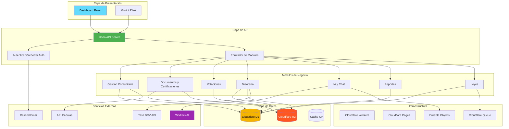
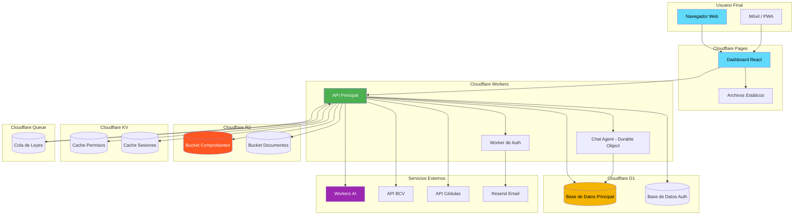
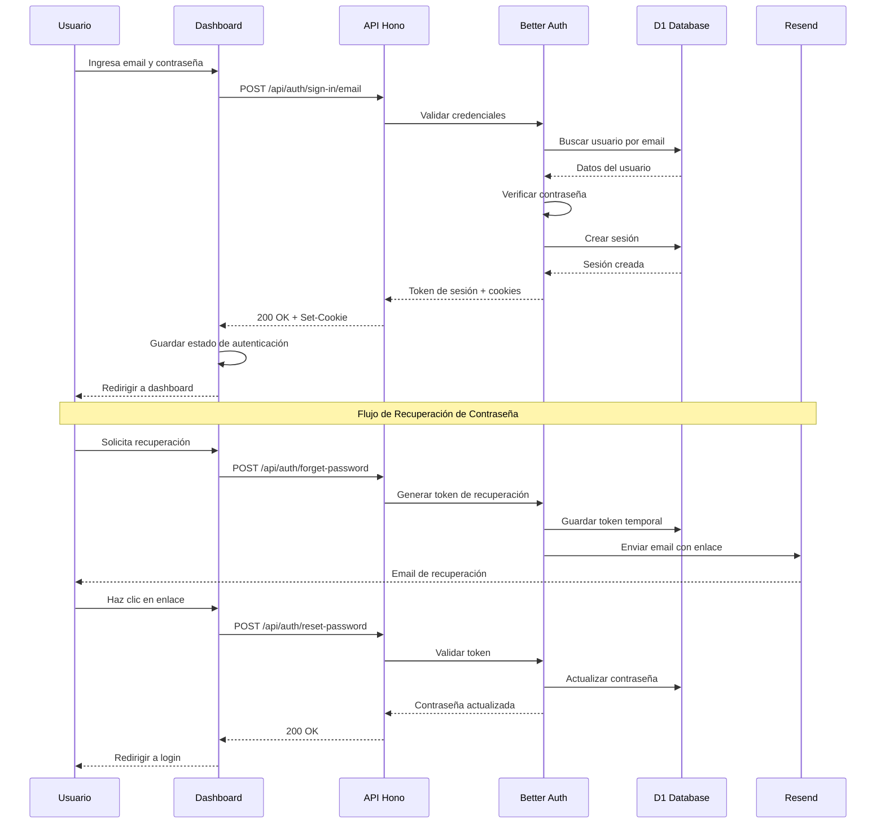
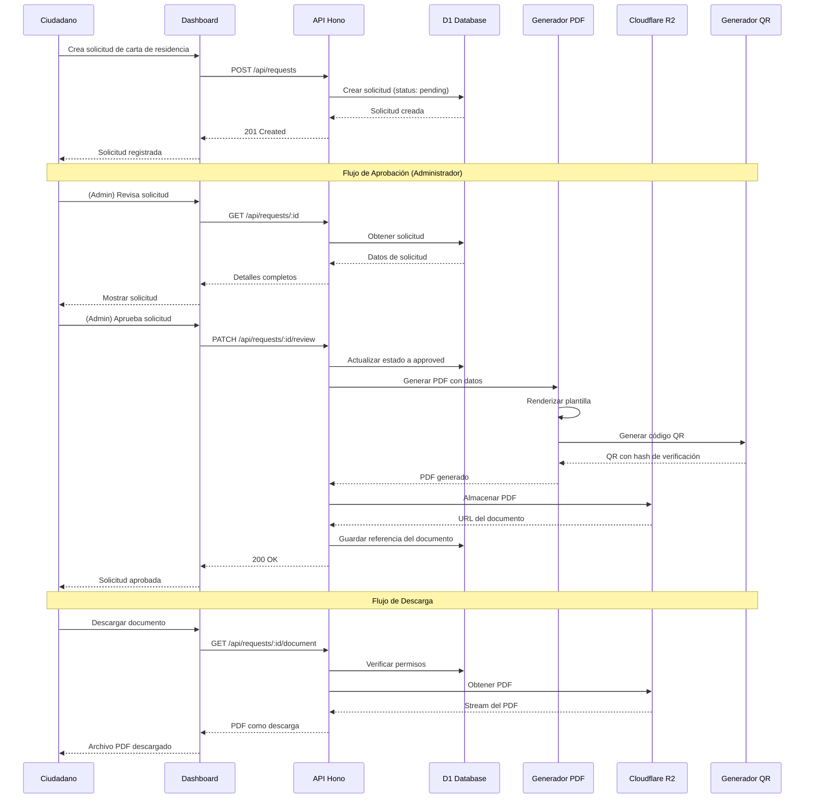
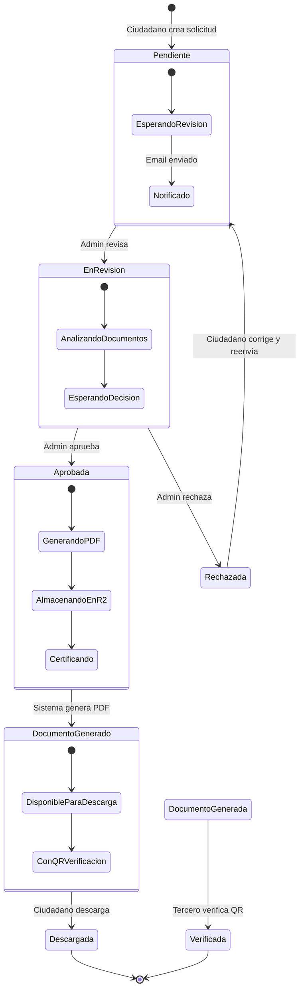
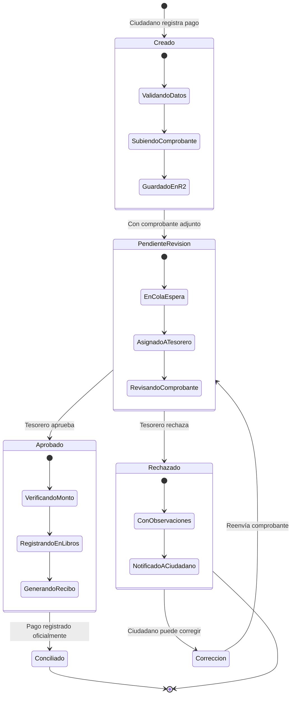
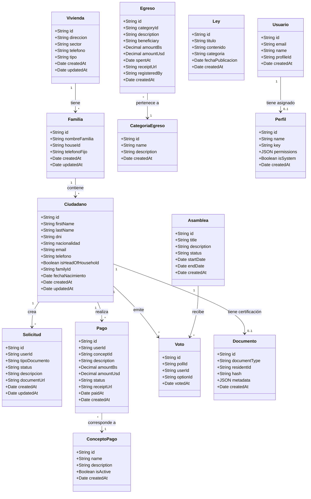
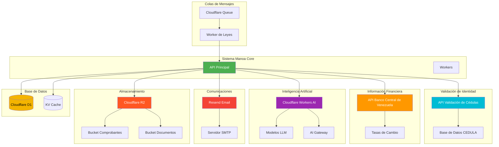

# Diagramas Técnicos del Sistema - Manoa Core

## Visión General

Este documento contiene los diagramas técnicos que complementan los diagramas de caso de uso. Todos los diagramas están orientados verticalmente (de arriba hacia abajo) para mejor legibilidad.

---

## 1. Diagrama de Arquitectura del Sistema



**Descripción:**
- **Capa de Presentación**: Dashboard web (React) y posibles clientes móviles
- **Capa de API**: Servidor Hono con autenticación y enrutamiento
- **Módulos de Negocio**: Lógica específica de cada funcionalidad
- **Capa de Datos**: Almacenamiento en Cloudflare (D1, R2, KV)
- **Servicios Externos**: Integraciones con APIs externas
- **Infraestructura**: Servicios de Cloudflare que ejecutan el sistema

---

## 2. Diagrama de Despliegue en Cloudflare



**Descripción:**
- **Cloudflare Pages**: Hosts el dashboard React y archivos estáticos
- **Cloudflare Workers**: Ejecuta la API principal y lógica de negocio
- **Durable Objects**: Maneja conexiones WebSocket para chat en tiempo real
- **D1**: Base de datos relacional para datos transaccionales
- **R2**: Almacenamiento de objetos para comprobantes y documentos
- **KV**: Cache de alta velocidad para permisos y sesiones
- **Queue**: Cola de mensajes para tareas asíncronas (scraping de leyes)

---

## 3. Diagrama de Secuencia - Flujo de Autenticación



**Descripción:**
1. El usuario ingresa sus credenciales en el formulario
2. El dashboard envía la petición a la API
3. Better Auth valida las credenciales contra la base de datos
4. Se crea una sesión y se devuelven cookies de autenticación
5. El dashboard almacena el estado y redirige al usuario

---

## 4. Diagrama de Secuencia - Generación de Documentos



**Descripción:**
1. El ciudadano crea una solicitud desde el dashboard
2. El administrador revisa y aprueba la solicitud
3. El sistema genera automáticamente el PDF con los datos del ciudadano
4. Se genera un código QR para verificación futura
5. El PDF se almacena en R2 y se devuelve al usuario

---

## 5. Diagrama de Estados - Ciclo de Vida de una Solicitud



**Descripción:**
- **Pendiente**: Solicitud creada, esperando revisión del administrador
- **En Revision**: Administrador está evaluando la solicitud
- **Aprobada**: Solicitud validada, sistema genera el documento
- **Rechazada**: Solicitud denegada (puede ser corregida)
- **Documento Generado**: PDF listo para descarga
- **Descargada**: Ciudadano obtuvo el documento
- **Verificada**: Tercero validó la autenticidad del documento

---

## 6. Diagrama de Estados - Ciclo de Vida de un Pago



**Descripción:**
- **Creado**: Ciudadano registra el pago con comprobante
- **Pendiente Revision**: Esperando que el tesorero revise
- **Aprobado**: Pago validado y registrado
- **Rechazado**: Pago denegado con observaciones
- **Conciliado**: Pago integrado oficialmente en contabilidad

---

## 7. Diagrama de Clases/Entidades del Dominio



**Descripción:**
- **Vivienda**: Representa una casa o apartamento en la comunidad
- **Familia**: Unidad familiar que habita una vivienda
- **Ciudadano**: Persona miembro de una familia
- **Solicitud**: Petición de documento legal
- **Pago**: Registro de pago realizado por un ciudadano
- **ConceptoPago**: Tipo de pago (cuota, multa, etc.)
- **CategoriaEgreso**: Categoría de gasto
- **Egreso**: Registro de gasto del consejo comunal
- **Asamblea**: Votación comunitaria
- **Voto**: Voto emitido por un ciudadano
- **Documento**: Certificación digital de un documento
- **Ley**: Legislación venezolana
- **Perfil**: Rol del usuario en el sistema
- **Usuario**: Cuenta de usuario del sistema

---

## 8. Diagrama de Componentes - Frontend (Dashboard)

```mermaid
graph TB
    subgraph "Aplicación Principal"
        App[App.tsx]
        Router[Router Principal]
    end

    subgraph "Rutas Públicas"
        AuthRoute[/_authenticated/auth]
        VerifyRoute[/verify]
    end

    subgraph "Rutas Autenticadas"
        IndexRoute[/]
        HousesRoute[/houses]
        FamiliesRoute[/families]
        CitizensRoute[/citizens]
        PollsRoute[/polls]
        RequestsRoute[/requests]
        ValidationsRoute[/validations]
        LawsRoute[/laws]
        TreasuryRoute[/treasury]
        SettingsRoute[/settings]
        UsersRoute[/users]
        ProfilesRoute[/profiles]
        AIRoute[/ai-assistant]
        MeetingsRoute[/meetings]
    end

    subgraph "Widgets"
        HouseTable[HouseTable]
        FamilyTable[FamilyTable]
        CitizenTable[CitizenTable]
        PollCard[PollCard]
        RequestList[RequestList]
        TreasuryDashboard[TreasuryDashboard]
        StatsOverview[StatsOverview]
    end

    subgraph "Features"
        AIChat[AI Chat]
        DocumentGenerator[Document Generator]
        PaymentForm[Payment Form]
        VoteForm[Vote Form]
        CSVImport[CSV Import]
        CSVExport[CSV Export]
    end

    subgraph "Shared UI"
        DataTable[DataTable]
        SearchInput[SearchInput]
        Pagination[Pagination]
        Modal[Modal]
        Toast[Toast]
        ProtectedRoute[ProtectedRoute]
    end

    subgraph "Hooks"
        UseAuth[useAuth]
        UseQuery[useQuery]
        UseMutation[useMutation]
        UseMobile[useMobile]
    end

    subgraph "Lib"
        AuthClient[authClient]
        APIClient[apiClient]
        Utils[utils]
    end

    App --> Router
    
    Router --> AuthRoute
    Router --> VerifyRoute
    Router --> IndexRoute
    Router --> HousesRoute
    Router --> FamiliesRoute
    Router --> CitizensRoute
    Router --> PollsRoute
    Router --> RequestsRoute
    Router --> ValidationsRoute
    Router --> LawsRoute
    Router --> TreasuryRoute
    Router --> SettingsRoute
    Router --> UsersRoute
    Router --> ProfilesRoute
    Router --> AIRoute
    Router --> MeetingsRoute
    
    HousesRoute --> HouseTable
    FamiliesRoute --> FamilyTable
    CitizensRoute --> CitizenTable
    PollsRoute --> PollCard
    RequestsRoute --> RequestList
    TreasuryRoute --> TreasuryDashboard
    IndexRoute --> StatsOverview
    
    AIRoute --> AIChat
    RequestsRoute --> DocumentGenerator
    TreasuryRoute --> PaymentForm
    PollsRoute --> VoteForm
    HousesRoute --> CSVImport
    HousesRoute --> CSVExport
    
    HouseTable --> DataTable
    FamilyTable --> DataTable
    CitizenTable --> DataTable
    SearchInput --> DataTable
    Pagination --> DataTable
    
    AuthRoute --> ProtectedRoute
    HousesRoute --> ProtectedRoute
    
    UseAuth --> AuthClient
    UseQuery --> APIClient
    UseMutation --> APIClient
    
    style App fill:#61DAFB,color:#000
    style Router fill:#4CAF50,color:#fff
    style ProtectedRoute fill:#FF9800,color:#fff
    style AIChat fill:#9C27B0,color:#fff
```

**Descripción:**
- **Aplicación Principal**: Punto de entrada y enrutador
- **Rutas Públicas**: Páginas accesibles sin autenticación
- **Rutas Autenticadas**: Páginas que requieren sesión activa
- **Widgets**: Componentes reutilizables de UI
- **Features**: Funcionalidades completas del negocio
- **Shared UI**: Componentes base de interfaz
- **Hooks**: Lógica reutilizable de React
- **Lib**: Utilidades y clientes de API

---

## 9. Diagrama de Permisos RBAC

```mermaid
graph TB
    subgraph "Sistema de Control de Acceso"
        RBAC[RBAC Engine]
    end

    subgraph "Perfiles del Sistema"
        SuperAdmin[Super Admin]
        Admin[Administrador]
        Treasurer[Tesorero]
        Secretary[Secretario]
        Citizen[Ciudadano]
    end

    subgraph "Módulos"
        M_HOUSES[Viviendas]
        M_FAMILIES[Familias]
        M_CITIZENS[Ciudadanos]
        M_DOCUMENTS[Documentos]
        M_REQUESTS[Solicitudes]
        M_POLLS[Votaciones]
        M_TREASURY[Tesorería]
        M_PAYMENTS[Pagos]
        M_REPORTS[Reportes]
        M_LAWS[Leyes]
        M_PROFILES[Perfiles]
        M_USERS[Usuarios]
        M_SETTINGS[Configuración]
    end

    subgraph "Acciones"
        A_READ[Lectura]
        A_CREATE[Crear]
        A_UPDATE[Actualizar]
        A_DELETE[Eliminar]
        A_MANAGE[Gestionar]
    end

    RBAC --> SuperAdmin
    RBAC --> Admin
    RBAC --> Treasurer
    RBAC --> Secretary
    RBAC --> Citizen

    SuperAdmin --> M_HOUSES
    SuperAdmin --> M_FAMILIES
    SuperAdmin --> M_CITIZENS
    SuperAdmin --> M_DOCUMENTS
    SuperAdmin --> M_REQUESTS
    SuperAdmin --> M_POLLS
    SuperAdmin --> M_TREASURY
    SuperAdmin --> M_PAYMENTS
    SuperAdmin --> M_REPORTS
    SuperAdmin --> M_LAWS
    SuperAdmin --> M_PROFILES
    SuperAdmin --> M_USERS
    SuperAdmin --> M_SETTINGS

    Admin --> M_HOUSES
    Admin --> M_FAMILIES
    Admin --> M_CITIZENS
    Admin --> M_DOCUMENTS
    Admin --> M_REQUESTS
    Admin --> M_POLLS
    Admin --> M_TREASURY
    Admin --> M_PAYMENTS
    Admin --> M_REPORTS
    Admin --> M_LAWS
    Admin --> M_SETTINGS

    Treasurer --> M_TREASURY
    Treasurer --> M_PAYMENTS

    Secretary --> M_DOCUMENTS
    Secretary --> M_REQUESTS

    Citizen --> M_REQUESTS
    Citizen --> M_POLLS
    Citizen --> M_TREASURY

    M_HOUSES --> A_READ
    M_HOUSES --> A_CREATE
    M_HOUSES --> A_UPDATE
    M_HOUSES --> A_DELETE

    M_PROFILES --> A_MANAGE
    M_USERS --> A_MANAGE

    style RBAC fill:#607D8B,color:#fff
    style SuperAdmin fill:#F44336,color:#fff
    style Admin fill:#2196F3,color:#fff
    style Treasurer fill:#FF9800,color:#fff
    style Secretary fill:#4CAF50,color:#fff
    style Citizen fill:#9E9E9E,color:#fff
```



**Descripción:**
- **Super Admin**: Acceso total a todos los módulos y configuración
- **Administrador**: Acceso a la mayoría de módulos excepto RBAC
- **Tesorero**: Acceso enfocado a tesorería y pagos
- **Secretario**: Acceso a documentos y solicitudes
- **Ciudadano**: Acceso limitado a sus propias solicitudes y votaciones

---

## 10. Diagrama de Integración Externa



**Descripción:**
- **API de Cédulas**: Validación de cédulas venezolanas contra base de datos oficial
- **API BCV**: Obtención de tasas de cambio oficiales
- **Workers AI**: Procesamiento de lenguaje natural para el chat y generación de documentos
- **Resend**: Envío de emails transaccionales
- **R2**: Almacenamiento persistente de archivos
- **D1**: Base de datos relacional principal
- **Queue**: Procesamiento asíncrono de tareas pesadas

---

## Resumen de Diagramas

| Diagrama | Propósito | Audiencia |
|----------|-----------|-----------|
| **Arquitectura** | Visión general del sistema | Desarrolladores, Arquitectos |
| **Despliegue** | Infraestructura en Cloudflare | DevOps, Desarrolladores |
| **Secuencia Auth** | Flujo de autenticación | Desarrolladores, QA |
| **Secuencia Documentos** | Generación de documentos | Desarrolladores, Negocio |
| **Estados Solicitud** | Ciclo de vida de solicitudes | Negocio, Usuarios |
| **Estados Pago** | Ciclo de vida de pagos | Negocio, Tesoreros |
| **Clases/Entidades** | Modelo de datos | Desarrolladores, DBAs |
| **Componentes Front** | Estructura del dashboard | Frontend Developers |
| **RBAC** | Sistema de permisos | Administradores, Seguridad |
| **Integración** | Conexiones externas | Desarrolladores, DevOps |

---

## Cómo Usar Estos Diagramas

### Para Documentación Técnica
- Incluye en `README.md` del repositorio
- Agrega a la wiki del proyecto
- Usa en documentación de arquitectura

### Para Presentaciones
- Exporta como PNG desde Mermaid Live Editor
- Inserta en diapositivas
- Úsalos para explicar el sistema a stakeholders

### Para Desarrollo
- Referencia durante el desarrollo
- Usa para onboardar nuevos desarrolladores
- Actualiza cuando cambie la arquitectura

---

*Documento generado automáticamente basado en la estructura del código fuente de Manoa Core.*
*Última actualización: Julio 2026*
