# Diagramas de Caso de Uso - Manoa Core

## Visión General del Sistema

**Manoa Core** es un sistema integral de gestión comunitaria para Consejos Comunales en Venezuela. Permite la administración de viviendas, familias, ciudadanos, documentos legales, votaciones comunitarias, tesorería y asistencia con inteligencia artificial.

---

## Actores del Sistema

| Actor | Descripción |
|-------|-------------|
| **Ciudadano** | Miembro registrado de la comunidad. Puede consultar sus datos, crear solicitudes, votar, realizar pagos y usar el asistente IA. |
| **Administrador** | Usuario con permisos elevados. Puede gestionar todo el contenido, aprobar solicitudes, revisar pagos y administrar usuarios. |
| **Super Admin** | Usuario con acceso total al sistema. Puede configurar perfiles RBAC, permisos y configuraciones avanzadas. |
| **Sistema** | Actor automatizado que ejecuta tareas como scraping de leyes, generación de documentos y validaciones externas. |

---

## 1. Módulo de Autenticación

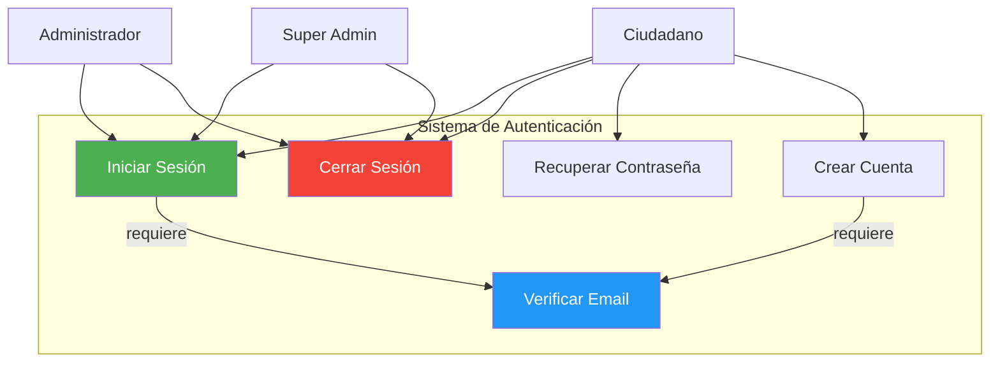

**Descripción:**
- **Iniciar Sesión**: El usuario ingresa sus credenciales (email/contraseña) para acceder al sistema.
- **Cerrar Sesión**: El usuario termina su sesión activa.
- **Recuperar Contraseña**: El usuario solicita un enlace de recuperación por email.
- **Verificar Email**: El sistema valida la dirección de correo electrónico del usuario.
- **Crear Cuenta**: Un nuevo usuario se registra en el sistema (requiere verificación de email).

---

## 2. Módulo de Gestión Comunitaria

```mermaid
graph TB
    subgraph "Gestión de Viviendas"
        UC6[Crear Vivienda]
        UC7[Editar Vivienda]
        UC8[Eliminar Vivienda]
        UC9[Listar Viviendas]
        UC10[Buscar Viviendas]
    end

    subgraph "Gestión de Familias"
        UC11[Crear Familia]
        UC12[Editar Familia]
        UC13[Eliminar Familia]
        UC14[Listar Familias]
        UC15[Buscar Familias]
    end

    subgraph "Gestión de Ciudadanos"
        UC16[Crear Ciudadano]
        UC17[Editar Ciudadano]
        UC18[Eliminar Ciudadano]
        UC19[Listar Ciudadanos]
        UC20[Buscar Ciudadanos]
        UC21[Validar Cédula]
    end

    Ciudadano --> UC9
    Ciudadano --> UC14
    Ciudadano --> UC19
    
    Administrador --> UC6
    Administrador --> UC7
    Administrador --> UC8
    Administrador --> UC9
    Administrador --> UC10
    Administrador --> UC11
    Administrador --> UC12
    Administrador --> UC13
    Administrador --> UC14
    Administrador --> UC15
    Administrador --> UC16
    Administrador --> UC17
    Administrador --> UC18
    Administrador --> UC19
    Administrador --> UC20
    Administrador --> UC21
    
    UC16 -->|usa| UC21
    UC17 -->|usa| UC21
    
    style UC6 fill:#8BC34A,color:#fff
    style UC11 fill:#8BC34A,color:#fff
    style UC16 fill:#8BC34A,color:#fff
    style UC21 fill:#FF9800,color:#fff
```

**Descripción:**
- **Gestión de Viviendas**: CRUD completo de viviendas con información de dirección, sector y características.
- **Gestión de Familias**: Administración de unidades familiares vinculadas a viviendas.
- **Gestión de Ciudadanos**: Registro de personas con validación de cédula venezolana (V/E) contra base de datos externa.
- **Validar Cédula**: Consulta a sistema externo para verificar la autenticidad de la cédula de identidad.

---

## 3. Módulo de Inteligencia Artificial

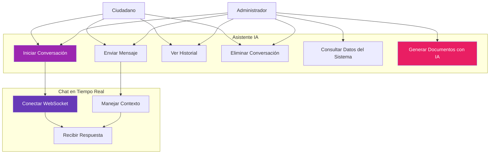

**Descripción:**
- **Iniciar Conversación**: El usuario crea un nuevo chat con el asistente IA.
- **Enviar Mensaje**: El usuario escribe una pregunta o solicitud al asistente.
- **Consultar Datos del Sistema**: El asistente IA puede acceder a la base de datos para responder preguntas sobre la comunidad.
- **Generar Documentos con IA**: El sistema genera documentos legales (cartas de residencia, constancias, etc.) utilizando inteligencia artificial.
- **Conectar WebSocket**: El chat utiliza conexiones en tiempo real para respuestas instantáneas.

---

## 4. Módulo de Documentos y Certificaciones

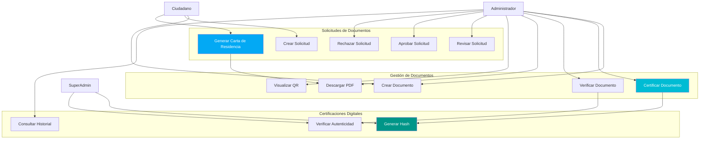

**Descripción:**
- **Crear Documento**: El administrador genera un nuevo documento legal.
- **Certificar Documento**: El sistema crea una certificación digital con hash SHA-256.
- **Verificar Documento**: Cualquier persona puede verificar la autenticidad de un documento usando su hash o código QR.
- **Crear Solicitud**: Los ciudadanos solicitan documentos (cartas de residencia, constancias, etc.).
- **Revisar/Aprobar/Rechazar Solicitud**: El administrador evalúa las solicitudes pendientes.
- **Generar Carta de Residencia**: El sistema genera automáticamente el documento PDF con los datos del ciudadano.

---

## 5. Módulo de Votaciones Comunitarias

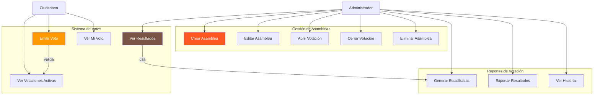

**Descripción:**
- **Crear Asamblea**: El administrador configura una nueva votación con opciones, fechas y reglas.
- **Abrir/Cerrar Votación**: El administrador controla el período de votación.
- **Ver Votaciones Activas**: Los ciudadanos ven las votaciones disponibles para participar.
- **Emitir Voto**: El ciudadano selecciona su opción y registra su voto (un voto por usuario).
- **Ver Resultados**: El administrador y ciudadanos pueden ver los resultados en tiempo real.

---

## 6. Módulo de Tesorería

```mermaid
graph TB
    subgraph "Gestión de Ingresos"
        UC56[Crear Pago]
        UC57[Ver Mis Pagos]
        UC58[Subir Comprobante]
        UC59[Editar Pago Rechazado]
        UC60[Descargar Comprobante]
    end

    subgraph "Gestión de Egresos"
        UC61[Crear Egreso]
        UC62[Editar Egreso]
        UC63[Eliminar Egreso]
        UC64[Listar Egresos]
    end

    subgraph "Administración Financiera"
        UC65[Gestionar Categorías]
        UC66[Gestionar Conceptos]
        UC67[Configurar Tasa de Cambio]
        UC68[Obtener Tasa BCV]
        UC69[Ver Transparencia]
    end

    subgraph "Revisión de Pagos"
        UC70[Listar Todos los Pagos]
        UC71[Aprobar Pago]
        UC72[Rechazar Pago]
        UC73[Verificar Comprobante]
    end

    Ciudadano --> UC56
    Ciudadano --> UC57
    Ciudadano --> UC58
    Ciudadano --> UC59
    Ciudadano --> UC60
    Ciudadano --> UC69
    
    Administrador --> UC61
    Administrador --> UC62
    Administrador --> UC63
    Administrador --> UC64
    Administrador --> UC65
    Administrador --> UC66
    Administrador --> UC67
    Administrador --> UC68
    Administrador --> UC70
    Administrador --> UC71
    Administrador --> UC72
    Administrador --> UC73
    
    UC56 -->|requiere| UC58
    UC71 -->|usa| UC73
    
    style UC56 fill:#4CAF50,color:#fff
    style UC61 fill:#f44336,color:#fff
    style UC68 fill:#2196F3,color:#fff
```

**Descripción:**
- **Crear Pago**: El ciudadano registra un pago con monto en Bs/USD y sube comprobante.
- **Gestionar Categorías/Conceptos**: El administrador configura los tipos de ingresos y egresos.
- **Configurar Tasa de Cambio**: El administrador establece la tasa del día o la obtiene automáticamente del BCV.
- **Aprobar/Rechazar Pago**: El administrador revisa los pagos y adjunta observaciones.
- **Ver Transparencia**: Los ciudadanos pueden ver un resumen de ingresos y egresos (transparencia financiera).

---

## 7. Módulo de Reportes e Importación

```mermaid
graph TB
    subgraph "Exportación de Datos"
        UC74[Exportar Ciudadanos CSV]
        UC75[Exportar Familias CSV]
        UC76[Exportar Viviendas CSV]
        UC77[Exportar Pagos CSV]
    end

    subgraph "Importación de Datos"
        UC78[Importar Ciudadanos CSV]
        UC79[Importar Familias CSV]
        UC80[Importar Viviendas CSV]
    end

    subgraph "Reportes Estadísticos"
        UC81[Ver Dashboard de Métricas]
        UC82[Ver Estadísticas por Sector]
        UC83[Ver Composición de Población]
        UC84[Ver Solicitudes por Estado]
    end

    Administrador --> UC74
    Administrador --> UC75
    Administrador --> UC76
    Administrador --> UC77
    Administrador --> UC78
    Administrador --> UC79
    Administrador --> UC80
    Administrador --> UC81
    Administrador --> UC82
    Administrador --> UC83
    Administrador --> UC84
    
    Ciudadano --> UC81
    
    style UC74 fill:#8BC34A,color:#fff
    style UC78 fill:#FF9800,color:#fff
    style UC81 fill:#00BCD4,color:#fff
```

**Descripción:**
- **Exportar CSV**: El administrador puede descargar listados completos en formato CSV para informes externos.
- **Importar CSV**: El administrador puede cargar masivamente datos desde archivos CSV.
- **Dashboard de Métricas**: Vista general con totales de viviendas, familias, ciudadanos, solicitudes y votaciones.

---

## 8. Módulo de Leyes y Normativa

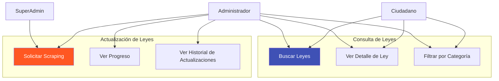

**Descripción:**
- **Buscar Leyes**: Los usuarios pueden buscar leyes por texto, categoría o fecha.
- **Solicitar Scraping**: El administrador inicia una sincronización de leyes desde fuentes oficiales.
- **Ver Progreso**: El sistema muestra el estado de la sincronización en segundo plano.

---

## 9. Módulo de Administración del Sistema

```mermaid
graph TB
    subgraph "Gestión de Usuarios"
        UC91[Listar Usuarios]
        UC92[Asignar Perfil]
        UC93[Ver Perfil de Usuario]
        UC94[Editar Perfil]
    end

    subgraph "Gestión de Perfiles RBAC"
        UC95[Crear Perfil]
        UC96[Editar Perfil]
        UC97[Eliminar Perfil]
        UC98[Configurar Permisos]
        UC99[Ver Permisos]
    end

    subgraph "Configuración del Consejo"
        UC100[Editar Perfil del Consejo]
        UC101[Configurar Datos Institucionales]
        UC102[Gestionar Firmantes]
        UC103[Subir Firma Digital]
    end

    subgraph "Gestión de Firmantes"
        UC104[Ver Firmantes]
        UC105[Actualizar Firmante]
        UC106[Subir Imagen de Firma]
    end

    Administrador --> UC91
    Administrador --> UC92
    Administrador --> UC93
    Administrador --> UC100
    Administrador --> UC101
    Administrador --> UC102
    Administrador --> UC103
    Administrador --> UC104
    Administrador --> UC105
    Administrador --> UC106
    
    SuperAdmin --> UC95
    SuperAdmin --> UC96
    SuperAdmin --> UC97
    SuperAdmin --> UC98
    SuperAdmin --> UC99
    
    style UC95 fill:#9C27B0,color:#fff
    style UC100 fill:#00BCD4,color:#fff
    style UC104 fill:#795548,color:#fff
```

**Descripción:**
- **Gestión de Usuarios**: El administrador puede listar, ver y asignar perfiles a usuarios.
- **Gestión de Perfiles RBAC**: Solo el Super Admin puede crear, editar y configurar perfiles con permisos granulares.
- **Configuración del Consejo**: El administrador configura los datos institucionales del Consejo Comunal (nombre, RIF, dirección, etc.).
- **Gestionar Firmantes**: El administrador administra las personas autorizadas para firmar documentos oficiales.

---

## 10. Diagrama General del Sistema

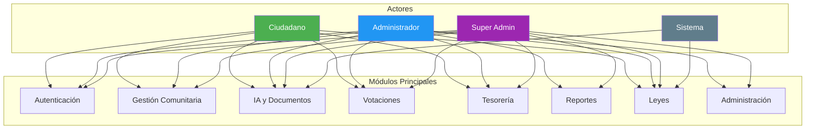

---

## Matriz de Permisos por Actor

| Módulo | Ciudadano | Administrador | Super Admin |
|--------|-----------|---------------|-------------|
| **Autenticación** | ✅ Login/Logout | ✅ Login/Logout | ✅ Login/Logout |
| **Viviendas** | 👁️ Solo lectura | ✅ CRUD completo | ✅ CRUD completo |
| **Familias** | 👁️ Solo lectura | ✅ CRUD completo | ✅ CRUD completo |
| **Ciudadanos** | 👁️ Solo lectura | ✅ CRUD completo | ✅ CRUD completo |
| **Asistente IA** | ✅ Chat básico | ✅ Chat + Consultas | ✅ Chat + Consultas |
| **Documentos** | ✅ Crear solicitud | ✅ CRUD completo | ✅ CRUD completo |
| **Certificaciones** | 👁️ Verificar | ✅ Certificar | ✅ Gestionar |
| **Votaciones** | ✅ Votar | ✅ CRUD completo | ✅ CRUD completo |
| **Tesorería** | ✅ Crear pago propio | ✅ CRUD completo | ✅ CRUD completo |
| **Reportes** | 👁️ Ver métricas | ✅ Exportar/Importar | ✅ Exportar/Importar |
| **Leyes** | 👁️ Consultar | ✅ Solicitar scraping | ✅ Solicitar scraping |
| **Usuarios** | ❌ | ✅ Asignar perfiles | ✅ CRUD completo |
| **Perfiles RBAC** | ❌ | ❌ | ✅ CRUD completo |
| **Configuración** | ❌ | ✅ Editar perfil consejo | ✅ Editar perfil consejo |
| **Firmantes** | 👁️ Ver | ✅ Actualizar | ✅ Actualizar |

---

## Relaciones entre Módulos

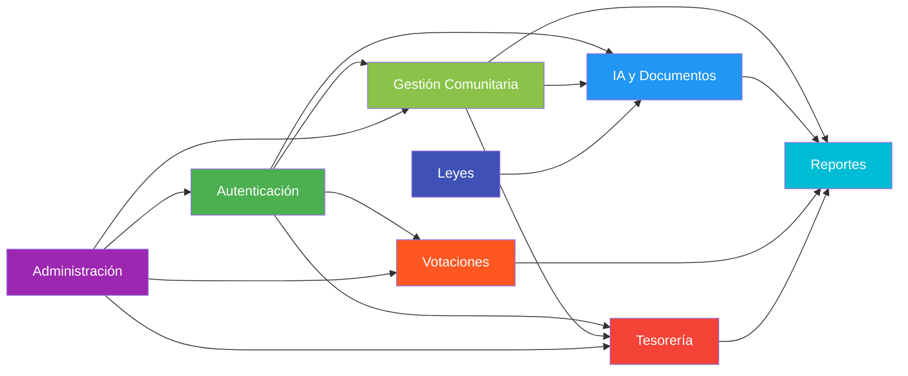

---

## Flujo de Usuario Típico

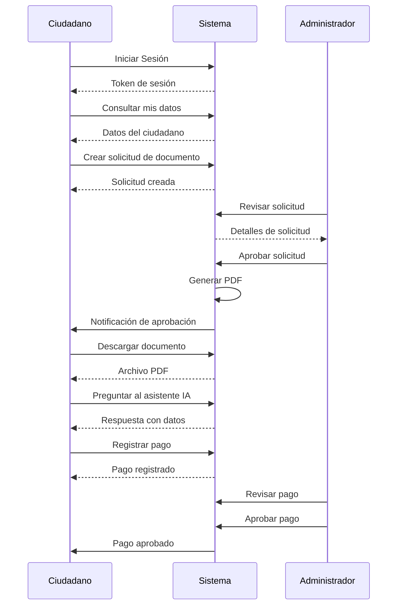

---

## Cómo Renderizar Estos Diagramas

### Opción 1: GitHub/GitLab
Los diagramas Mermaid se renderizan automáticamente en:
- README.md de GitHub
- Wikis de GitLab
- Issues y Pull Requests

### Opción 2: VS Code
Instala la extensión **Mermaid Preview**:
1. Abre Command Palette (Ctrl+Shift+P)
2. Escribe "Mermaid Preview"
3. Selecciona "Mermaid: Open Preview to the Side"

### Opción 3: Herramientas Online
Cualquiera de estas plataformas:
- [Mermaid Live Editor](https://mermaid.live/)
- [Mermaid Editor](https://www.mermaidchart.com/)
- [Draw.io](https://app.diagrams.net/) (soporta importar Mermaid)

### Opción 4: Documentación
Crea un archivo `.md` y visualízalo con:
- **Markdown Preview** en VS Code
- **Obsidian** para notas
- **Notion** para documentación

### Opción 5: Imágenes
Exporta como PNG/SVG desde el Mermaid Live Editor:
1. Copia el código del diagrama
2. Pega en [mermaid.live](https://mermaid.live/)
3. Haz clic en "Download" → Selecciona formato

---

## Resumen de Funcionalidades

| Categoría | Funcionalidades | Actores |
|-----------|-----------------|---------|
| **Autenticación** | Login, logout, recuperación, verificación | Todos |
| **Gestión Comunitaria** | CRUD de viviendas, familias, ciudadanos | Ciudadano (lectura), Admin (CRUD) |
| **IA** | Chat en tiempo real, consultas a datos | Todos |
| **Documentos** | Solicitud, generación, certificación, verificación | Ciudadano (solicitar), Admin (gestionar) |
| **Votaciones** | Crear asambleas, votar, ver resultados | Ciudadano (votar), Admin (gestionar) |
| **Tesorería** | Pagos, egresos, transparencia, tasa BCV | Ciudadano (pagar), Admin (gestionar) |
| **Reportes** | Exportar/Importar CSV, métricas | Admin |
| **Leyes** | Consulta, scraping actualizado | Todos (consulta), Admin (scraping) |
| **Administración** | Usuarios, perfiles RBAC, configuración | Admin, Super Admin |

---

*Documento generado automáticamente basado en la estructura del código fuente de Manoa Core.*
*Última actualización: Julio 2026*
